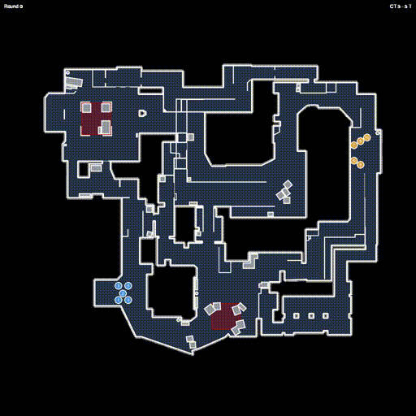

<div align="center">


# FragAudit

**CS2 Demo Analysis Engine**

[](LICENSE)
[](https://www.python.org/)
[](tests/)
[](CHANGELOG.md)

---



*Player positions, utility, kills — all extracted from demo files*

</div>

---

## Overview

FragAudit parses CS2 `.dem` files and generates tactical analysis:

- **Mistake Detection** — Flags overpeeks, failed trades, spacing errors
- **Role Classification** — Entry, Lurk, Anchor, Support per round
- **Win Probability** — Round-by-round predictions with factor breakdown
- **Strategy Detection** — Execute, Rush, Split, Default patterns
- **Radar Replay** — MP4 video with player positions and utility

---

## Quick Start

```bash
# Install
git clone https://github.com/Pl4yer-ONE/FragAudit.git
cd FragAudit
python -m venv venv && source venv/bin/activate
pip install -r requirements.txt

# Verify
python -m pytest tests/ -q  # 174 passed

# Analyze
python main.py analyze --demo match.dem --html --radar
```

---

## Radar Options

| Flag | Speed | Quality | Use Case |
|------|-------|---------|----------|
| `--radar` | 5-6 min | High (view cones, effects) | Final review |
| `--radar --fast-radar` | **90 sec** | Standard | Quick preview |

```bash
# Fast radar (3.7x faster)
python main.py analyze --demo match.dem --radar --fast-radar
```

---

## Output

| File | Description |
|------|-------------|
| `reports/coaching_report_*.json` | Raw analysis data |
| `reports/report_*.html` | Visual HTML report |
| `reports/radar_*.mp4` | Radar replay video |

---

## Prediction API

```python
from src.predict import predict_round_win

result = predict_round_win(
    team_economy=4500,
    enemy_economy=4500,
    team_alive=5,
    enemy_alive=3  # 5v3 advantage
)

print(result.probability)    # 61.8%
print(result.dominant_factor)  # man_advantage
```

---

## Backend Modules

| Module | Description |
|--------|-------------|
| `src/mistakes/` | 5 error types with severity |
| `src/roles/` | Entry, Lurk, Anchor, Rotator, Support |
| `src/wpa/` | Contextual win probability |
| `src/strategy/` | Strategy pattern detection |
| `src/predict/` | Win/impact prediction |
| `src/radar/` | Radar video generation |

---

## Performance

| Operation | Time |
|-----------|------|
| Demo analysis | ~7s |
| Radar (standard) | ~6 min |
| Radar (fast) | **~90s** |
| Unit tests | 0.8s |

---

## Screenshots

<details>
<summary>HTML Report</summary>


</details>

<details>
<summary>Player Cards</summary>


</details>

---

## License

**GNU General Public License v3.0**

Radar maps from [boltobserv](https://github.com/boltgolt/boltobserv) (GPL-3).  
See [THIRDPARTY.md](THIRDPARTY.md) for attribution.

---

<div align="center">

**174 tests. No ML libraries. Explicit coefficients.**

</div>
