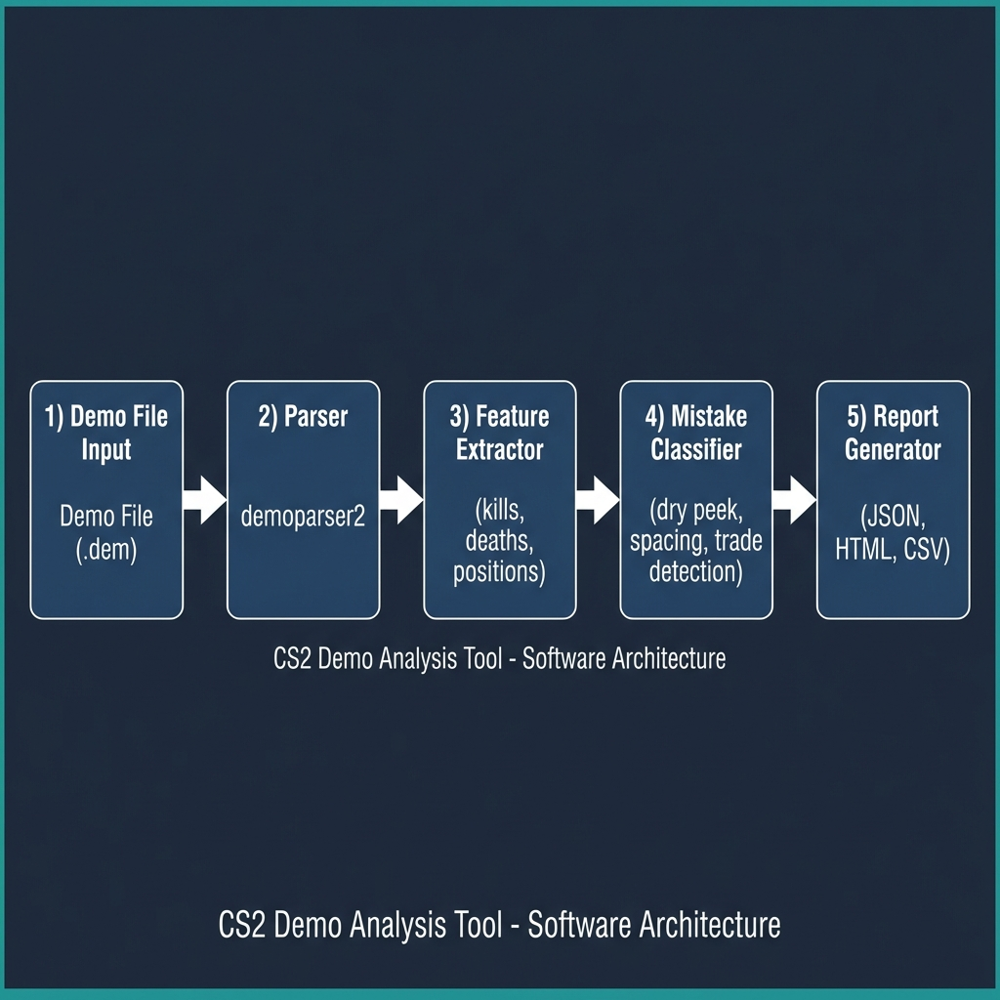
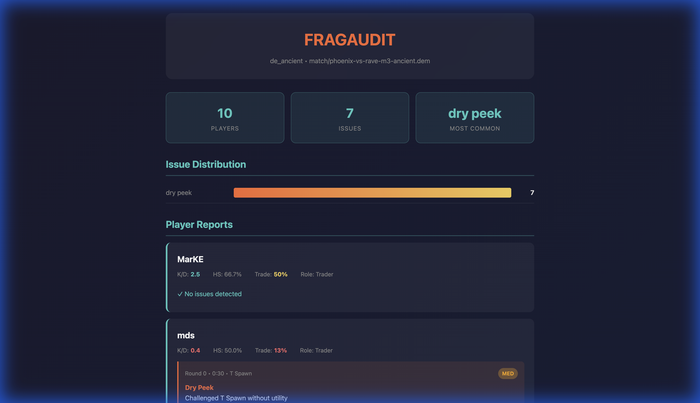
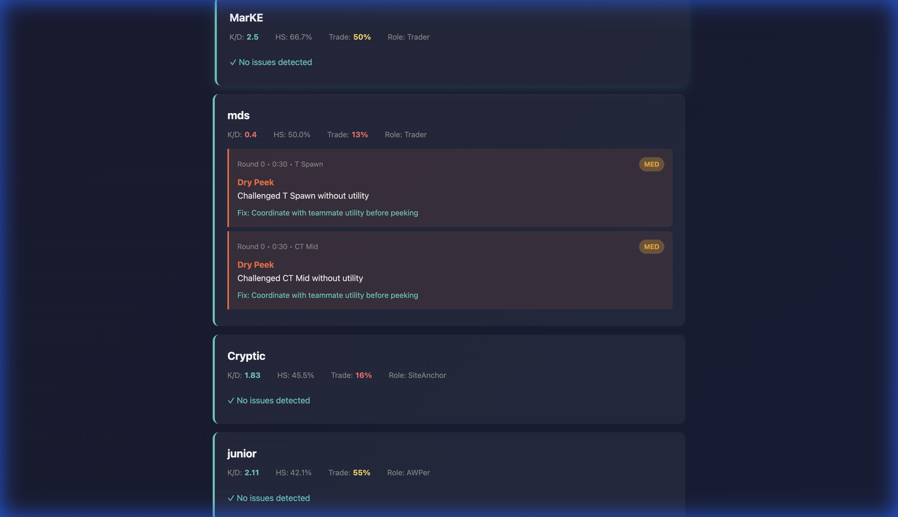

<div align="center">


# FragAudit

**Parses CS2 demos and flags positional mistakes using rule-based analysis.**

[](LICENSE)
[](docs/COMMERCIAL.md)
[](https://www.python.org/downloads/)
[](https://github.com/Pl4yer-ONE/FragAudit/actions)

</div>

---

## Architecture

<div align="center">



</div>

---

## What It Does

FragAudit reads CS2 demo files and identifies common positioning mistakes:

| Mistake Type | What It Detects | Severity |
|--------------|-----------------|----------|
| `dry_peek` | Challenged angle without flash support | MED |
| `dry_peek_awp` | Dry peeked into AWP | HIGH |
| `untradeable_death` | Died >400u from teammates | HIGH |
| `bad_spacing` | Stacked on 2+ teammates | MED |
| `solo_late_round` | Died alone in late round | MED |

---

## Key Metric: Trade Potential Score

**Trade Score** = Percentage of deaths where a teammate was positioned to trade.

| Score | Interpretation |
|-------|----------------|
| 60-100% | Good positioning — deaths are tradeable |
| 30-59% | Average — some positioning issues |
| 0-29% | Poor — frequently dying alone |

---

## Screenshots

### Report Overview
<div align="center">



*Issue distribution and match summary*

</div>

### Player Cards
<div align="center">



*Individual player stats with Trade Score and mistake details*

</div>

### Demo Player
<div align="center">


*Visual playback without CS2 installed*

</div>

### Radar Replay
<div align="center">


*Animated radar video with player movements, smokes, flashes, and kills*

</div>

---

## Who It's For

**Primary:** Competitive players reviewing scrims to fix positioning mistakes.

Also useful for:
- Coaches analyzing team VODs
- Analysts building match reports
- Developers building on demo parsing

---

## Installation

```bash
git clone https://github.com/Pl4yer-ONE/FragAudit.git
cd FragAudit
python -m venv venv
source venv/bin/activate  # Windows: venv\Scripts\activate
pip install -r requirements.txt
```

Verify:
```bash
python main.py check-parsers
```

---

## Usage

### Basic Analysis
```bash
python main.py analyze --demo match.dem
```

### Generate Reports
```bash
python main.py analyze --demo match.dem --html      # HTML report
python main.py analyze --demo match.dem --markdown  # Markdown
python main.py analyze --demo match.dem --csv       # CSV export
```

### AI Coaching (Optional)
```bash
python main.py analyze --demo match.dem --ollama --html
```

**Example AI Output:**
```
Input:
  dry_peek in Round 7 at A Long

Output:
  "You challenged A Long without utility — ask for a long flash from CT spawn next time."
```

---

## Sample Output

```
════════════════════════════════════════════════════════════
  FRAGAUDIT ANALYSIS
════════════════════════════════════════════════════════════

  Map: de_ancient
  Players: 10    Issues: 7

────────────────────────────────────────────────────────────
  PLAYER BREAKDOWN
────────────────────────────────────────────────────────────

  MarKE
    K/D: 2.5  HS: 66.7%  Trade: 50%  Role: Trader
    ✓ No issues detected

  Gabe
    K/D: 0.67  HS: 30.0%  Trade: 13%  Role: Trader
    🟡 [MED] R0 0:30 — dry peek

  Valter0k
    K/D: 0.47  HS: 71.4%  Trade: 6%  Role: Rotator
    🟡 [MED] R0 0:30 — dry peek

════════════════════════════════════════════════════════════
```

---

## Documentation

| Document | Description |
|----------|-------------|
| [USAGE.md](docs/USAGE.md) | Step-by-step usage guide |
| [TECHNICAL.md](docs/TECHNICAL.md) | Algorithms, data structures, architecture |
| [CONTRIBUTING.md](CONTRIBUTING.md) | Contribution guidelines |
| [CHANGELOG.md](CHANGELOG.md) | Version history |

---

## Project Structure

```
FragAudit/
├── main.py              # Entry point
├── src/
│   ├── parser/          # Demo parsing (demoparser2)
│   ├── features/        # Feature extraction
│   ├── classifier/      # Mistake detection rules
│   ├── report/          # JSON/Markdown/HTML output
│   ├── nlp/             # Ollama integration
│   └── maps/            # Coordinate → callout mapping
├── tests/               # 26 unit tests
├── match/               # Demo files
└── docs/                # Technical documentation
```

---

## Roadmap

### Completed
- [x] v3.0 — Mistake detection, JSON/Markdown reports, demo player
- [x] v3.1 — HTML reports, Ollama AI, severity labels
- [x] v3.1.1 — Trade Potential Score, CSV export
- [x] v3.2 — Kill heatmaps, radar replay video (boltobserv-style)
- [x] v3.2.1 — Smoke circles, flash radius, kill markers in radar

### Planned
- [ ] v3.3 — Round timeline visualization
- [ ] v3.4 — Team synergy report, multi-demo analysis

---

## Limitations

1. Round timing is approximated from tick offset
2. Map callouts may show "Unknown" for unmapped coordinates
3. Flash detection covers teammate flashes only
4. Role classification is heuristic-based
5. Radar replay covers first ~20 minutes (5000 frames) by default
6. Smoke/Flash durations are visually approximated

See [TECHNICAL.md](docs/TECHNICAL.md) for details.

---

## Contributing

GPLv3 licensed — contributions welcome.

```bash
python -m pytest tests/ -v
```

See [CONTRIBUTING.md](CONTRIBUTING.md) for guidelines.

---

## License

**FragAudit is Dual-Licensed:**

1.  **Community Use**: [GNU GPLv3](LICENSE)
    - Free for open source and personal use.
    - Modifications must be open-sourced.

2.  **Commercial Use**: [Commercial License](docs/COMMERCIAL.md)
    - For proprietary applications, closed-source distribution, and enterprise use.
    - [Contact us](docs/COMMERCIAL.md) for pricing.

*By using this software, you agree to the terms of one of these licenses.*

---

<div align="center">

*FragAudit — Turn demos into actionable mistakes.*

</div>
