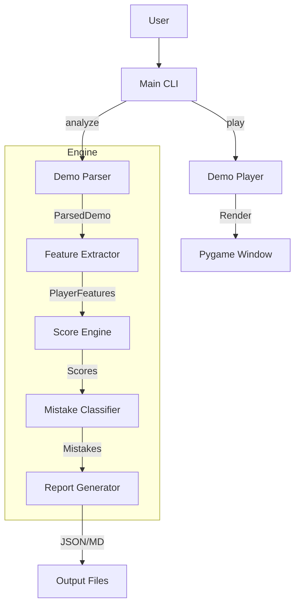

<div align="center">

# FragAudit

### CS2 Performance Verification Engine

[](https://www.python.org/downloads/)
[](LICENSE)
[](CHANGELOG.md)
[](https://github.com/Pl4yer-ONE/FragAudit/actions)

**Forensic demo analysis. Exploit-resistant ratings. Visual playback.**

---

[Installation](#installation) • [Demo Player](#demo-player) • [Analysis](#analysis) • [Roadmap](#roadmap) • [API](#api-reference)

</div>

---

## What is FragAudit?

FragAudit is a **forensic analysis engine** for Counter-Strike 2 demos. It combines:

- **Performance Auditing** — Telemetry-driven ratings with exploit resistance
- **Visual Playback** — Watch demos without CS2 installed
- **Role Detection** — AWPer, Entry, Trader, Rotator, Anchor from behavior

No magic numbers. No inflated stats. Just **audited performance**.

---

## Demo Player

**NEW in v3.0.0** — Standalone demo playback without CS2.

```bash
python main.py play match/demo.dem
```

<table>
<tr><td><b>Control</b></td><td><b>Action</b></td></tr>
<tr><td>Space</td><td>Play/Pause</td></tr>
<tr><td>←/→</td><td>Seek 5 seconds</td></tr>
<tr><td>↑/↓</td><td>Previous/Next round</td></tr>
<tr><td>+/-</td><td>Speed control (0.25x–4x)</td></tr>
<tr><td>1-9</td><td>Jump to round</td></tr>
<tr><td>ESC</td><td>Quit</td></tr>
</table>

**Features:**
- Dynamic tickrate detection (64/128 tick)
- O(log n) tick lookup with binary search
- LRU cache for smooth playback
- Delta-time clamped for stability

---

## Installation

### Quick Install (Recommended)

```bash
curl -sSL https://raw.githubusercontent.com/Pl4yer-ONE/FragAudit/main/install.sh | bash
```

### Manual Install

```bash
git clone https://github.com/Pl4yer-ONE/FragAudit.git
cd FragAudit

python -m venv venv
source venv/bin/activate  # Windows: venv\Scripts\activate

pip install -r requirements.txt
```

---

## Analysis

### Analyze Demo
```bash
python main.py analyze --demo match.dem
```

### Generate Reports
```bash
python main.py analyze --demo match.dem --output report.json --markdown
```

### Generate Heatmaps
```bash
python main.py analyze --demo match.dem --heatmap
```

### Check Parser Status
```bash
python main.py check-parsers
```

---

## Rating System

### Score Bands

| Rating | Meaning |
|--------|---------|
| 95-100 | Elite |
| 85-94 | Carry |
| 70-84 | Strong |
| 50-69 | Average |
| 30-49 | Below Average |
| 15-29 | Liability |

### Anti-Exploit Rules

| Rule | Trigger | Effect |
|------|---------|--------|
| Kill Gate | raw > 105, kills < 18 | 0.90x |
| Exit Tax | exits >= 8 | 0.85x |
| Low KDR Cap | KDR < 0.8 | max 75 |
| Trader Ceiling | Trader, KDR < 1.0 | max 80 |
| Rotator Ceiling | Rotator role | max 95 |
| Floor | Always | min 15 |

---

## Architecture



## Demo Preview


> *Visual playback of a Dust2 match running at 64 tick.*

---

## API Reference

### Demo Player
```python
from src.player import DemoPlayer, Renderer

player = DemoPlayer("match/demo.dem")
renderer = Renderer(player)
renderer.run()
```

### Score Engine
```python
from src.metrics.scoring import ScoreEngine

rating = ScoreEngine.compute_final_rating(
    scores={"raw_impact": 100},
    role="Entry",
    kdr=1.2,
    kills=18,
    exit_frags=3
)
```

### Player Tracker
```python
from src.analytics.player_tracker import PlayerTracker

tracker = PlayerTracker()
tracker.load_directory("./outputs")
comparison = tracker.compare_players()
```

---

## Testing

```bash
python -m pytest tests/ -v
```

26 tests covering calibration, caps, and edge cases.

---

## Performance

| Metric | Value |
|--------|-------|
| Tick lookup | O(log n) binary search |
| Cache | 500-entry LRU |
| Frame skip | Scales with speed |
| dt clamp | 100ms max (stability) |

---

## License

FragAudit is licensed under the **PolyForm Noncommercial License 1.0.0**.

Commercial use is **strictly prohibited** without explicit written permission.
For commercial licensing inquiries, open an issue on GitHub.

---

<div align="center">

**FragAudit** — *Where every frag gets audited.*

*v3.0.1+ — Noncommercial Edition*

</div>
